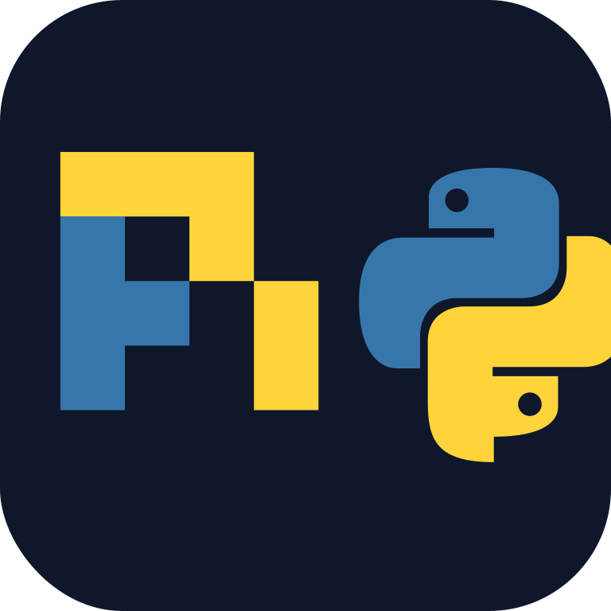
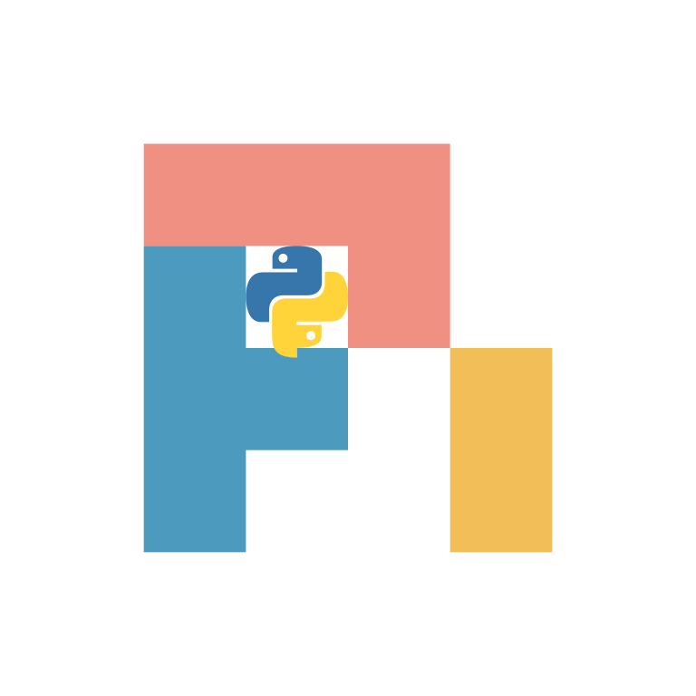

# Logo options

Same elements (Pi geometric mark + Python dual-snake badge), five styles.
Pick one for `docs/logo.svg` / `docs/logo.png` and the README header.

| # | Style | Preview |
| --- | --- | --- |
| 1 | Dark notch |  |
| 2 | Light notch |  |
| 3 | Circular seal |  |
| 4 | Side-by-side |  |
| 5 | Pi palette float |  |

- **1 Dark notch** — rounded dark tile; snakes in the π open square (current README candidate).
- **2 Light notch** — same layout on a light tile.
- **3 Circular seal** — same mark inside a blue/yellow ring badge.
- **4 Side-by-side** — Pi mark left, full Python snakes right.
- **5 Pi palette float** — original Pi coral/blue/gold + Python snakes; no plate.

SVG sources sit beside each PNG in this folder.
